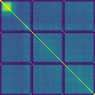

# RepNet PyTorch
A PyTorch port with pre-trained weights of **RepNet**, from *Counting Out Time: Class Agnostic Video Repetition Counting in the Wild* (CVPR 2020) [[paper]](https://arxiv.org/abs/2006.15418) [[project]](https://sites.google.com/view/repnet) [[notebook]](https://colab.research.google.com/github/google-research/google-research/blob/master/repnet/repnet_colab.ipynb#scrollTo=FUg2vSYhmsT0).

This repo provides an implementation of RepNet written in PyTorch and a script to convert the pre-trained TensorFlow weights provided by the authors. The outputs of the two implementations are almost identical, with a small deviation (less than $10^{-6}$ at most) probably caused by the [limited precision of floating point operations](https://pytorch.org/docs/stable/notes/numerical_accuracy.html).

<div align="center">
  
  
  
  
</div>

## Get Started
- Clone this repo and install dependencies:
```bash
git clone https://github.com/materight/RepNet-pytorch
cd RepNet-pytorch
pip install -r requirements.txt
```

- Download the pre-trained weights from [Hugging Face](https://huggingface.co/materight/repnet/blob/main/pytorch_weights.pth).

## Run inference
Simply run:
```bash
python run.py --weights [weights_path]
```
The script will download a sample video, run inference on it and save the count visualization. You can also specify a video path as argument (either a local path or a YouTube/HTTP URL):
```bash
python run.py --weights [weights_path] --video_path [video_path]
```
If the model does not produce good results, try to run the script with more stride values using `--strides`.

Example of generated videos showing the repetition count, with the periodicity score and the temporal self-similarity matrix:
<div align="center">
  
  
</div>
